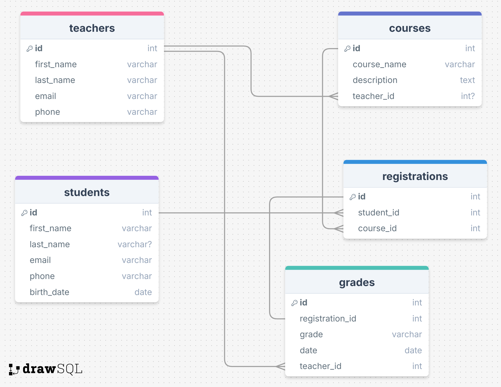

# SQL

# Tietokanta kurssinhallintajärjestelmää varten

Tämä on projekti kurssien, opiskelijoiden, opettajien, ilmoittautumisten ja arviointien luomiseen ja hallintaan. Tietokanta ylläpitää taulukoita, joihin tallennetaan tietoja kursseista, opiskelijoista, opettajista, opiskelijoiden ilmoittautumisia kursseille ja niiden arvosanat.

Tietokannan rakenne on esitetty tiedostossa: .

## Taulukoiden välinen suhde

1. **Opettajat ja kurssit**: Yksi moniin (yksi opettaja voi opettaa useita kursseja).
2. **Opiskelijat ja ilmoittautumiset**: Yksi moniin (yksi opiskelija voi ilmoittautua useille kursseille).
3. **Kurssit ja ilmoittautumiset**: Yksi moniin (yksi kurssi voi sisältää useita opiskelijoita).
4. **Ilmoittautumiset ja arvosanat**: Yhdestä moneen (yhdellä tietueella voi olla useita arvosanoja).
5. **Opettajat ja arvosanat**: Yksi moniin (yksi opettaja voi antaa useita arvosanoja).

## API-reitit

- **GET /courses_final**: Hanki luettelo kaikista kursseista.
- **GET /courses_final/teachers**: Hanki luettelo kaikista opettajista.
- **GET /courses_final/students**: Hanki luettelo kaikista opiskelijoista.
- **GET /courses_final/registrations**: Hae luettelo kaikista kursseille ilmoittautuneista opiskelijoista.
- **GET /courses_final/grades**: Hanki luettelo kaikista oppilaiden arvosanoista.
